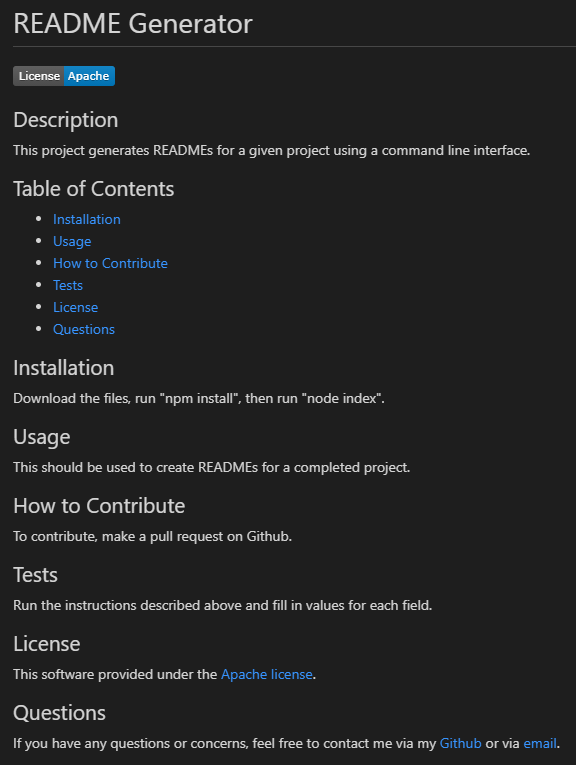

# README Generator

## Description

This is a command line interface application written in Node.js which uses the Inquirer package to generate a custom README file based on user input.  It will automatically generate the required links and create a badge for the appropriate software license.

## Installation

Download all of the files contained in this repository.  In the command line, run "npm install" and then "node index".

## Usage

To see a video of this program in action, check out [this video](https://youtu.be/86q9RHExyrc).

Here is a screenshot of a README generated by this application:

